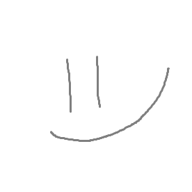
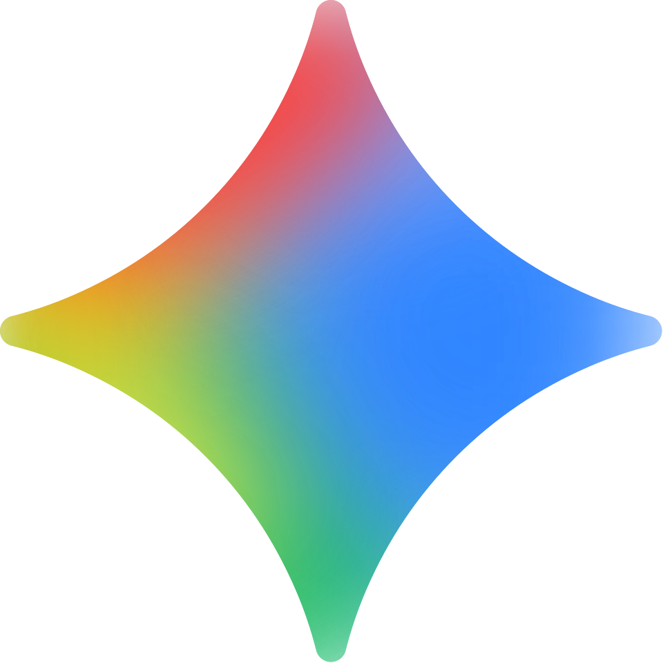

  
  <h1>rtyann</h1>
  
star this repo if u liked it ;3

  

    
  

  

    <a href="#english">english</a> • <a href="#belarusian">беларуская</a>
  

---

<h2 id="english">🇺🇸 English (US)</h2>

### style
* **glassmorphism** — sleek, translucent interface with liquid mesh background.
* **interactive** — featuring advanced tilt effects and a custom OS-style preloader.
* **i18n** — native localized experience for English and Belarusian users.

### changelog
* **2.0.3** — bug fixes, animation improvements and README redesign.
* **2.0.0** — initial interface redesign.

---

<h2 id="belarusian">🇧🇾 Беларуская</h2>

### style
* **glassmorphism** — гладкі напаўпразрысты інтэрфейс з аніміраваным mesh-фонам.
* **interactive** — інтэрактыўныя эфекты нахілу і кастомны прэлоадар у стылі АС.
* **i18n** — лакалізаваны інтэрфейс для англамоўных і беларускіх карыстальнікаў.

### гісторыя змен
* **2.0.3** — выпраўленне памылак, паляпшэнне анімацыі і рэдызайн README.
* **2.0.0** — пачатковы рэдызайн інтэрфейсу.

---

  

    made with 
    <b>Claude</b> 
     
    & 
    <b>Gemini</b> 
    
  

  
© rtyann · 2026

